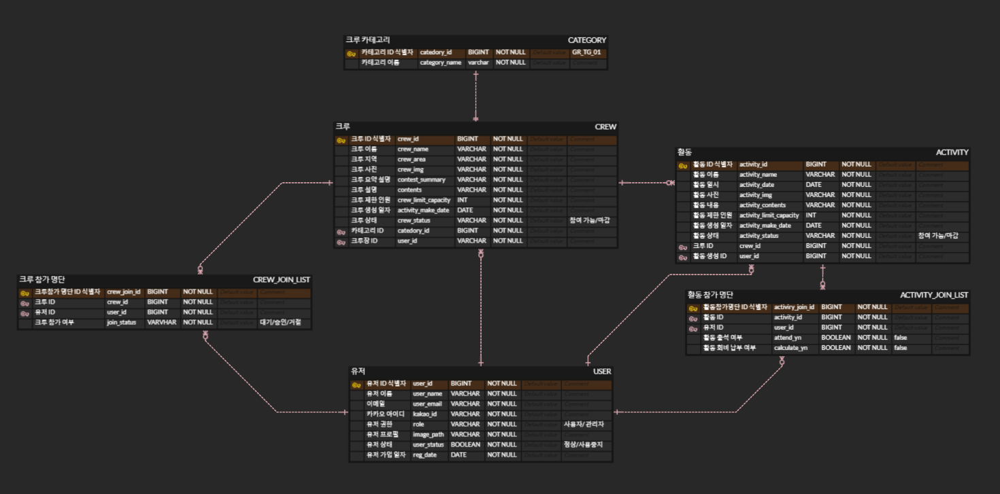

# 💡crew-management-service
- 크루를 내가 직접 만들 수 있고, 크루 활동을 게시하고 출석/회비 납부를 관리할 수 있는 서비스입니다.
- 크루에 참여할 수 있고, 내 크루 활동을 관리할 수 있는 서비스입니다.

- [크루장] 크루 생성 -> 크루 내 활동 생성 및 관리
- [크루원] 크루 가입 신청 -> 크루 내 활동 가능

***
### ⚙ Tech Stack

- Java 8 (JDK 1.8)
- Spring Boot
- DB : MariaDB
- Swagger `/swagger-ui/index.html`
- Library
    - Spring Data jpa
    - Spring Security
    - Elastic Search
    - +) 개발 중 추가 예정

 
   
   
   
  

 

***

### 💡프로젝트 기능 및 설계

- #### [회원가입/로그인] 기능
    - Spring Security + JWT 로그인
    - OAuth 2.0 기반 카카오 로그인
    - 사용자/관리자 권한

- #### [사용자] 기능
    - #### [크루 Crew]
        - #### [공통]
            - 크루 조회, 생성
            - 카테고리 별 크루 조회
            - 크루 별 크루원 조회
            - 크루 참여 가능 상태 (참여 가능/마감)
        - #### [크루장]
            - 크루 수정, 삭제
            - 유저 별 크루 참여 상태 변경 (대기/승인/거절)
        - #### [유저]
            - 크루 참여 요청 (요청/철회)
    - #### [활동 Activity]
        - #### [공통]
            - 크루 내 활동 조회
            - 활동 별 참가 크루원 조회
            - 크루원 별 참가 활동 조회
            - 활동 참여 가능 상태 (참여 가능/마감)
        - #### [크루장]
            - 크루 내 활동 생성/수정/삭제
            - 활동 참여 출석 관리
            - 활동 회비 납부 관리
        - #### [크루원]
            - 활동 참여 상태 설정 (참여/미참여)

- #### [관리자] 기능
    - #### [크루/활동 관리]
        - 크루 조회, 생성, 수정, 삭제 관리
        - 활동 조회, 생성, 수정, 삭제 관리
        - 크루 상태 변경(정상/사용 중지)
    - #### [유저 관리]
        - 사용자 가입 정보 조회, 생성, 수정, 삭제 관리
        - 유저 상태 변경 (정상/사용 중지)
        - 유저 별 침가 활동 명단 조회
        - 유저 별 참가 크루 명단 조회

***

### 💡ERD

자세히보기 -> https://www.erdcloud.com/d/Y3DBgK47XuMXqLoeT
 

***

### 💡Trouble Shooting
[go to the trouble shooting section](doc/TROUBLE_SHOOTING.md)
 

